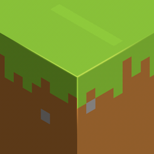
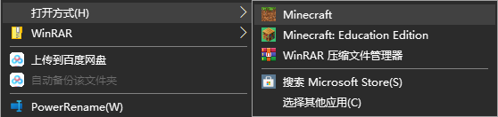
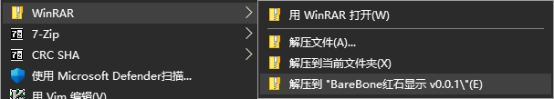

# BareBones红石显示
一个适用于 [BareBones材质包](https://mcpedl.com/bare-bones-be/) 的红石显示材质

基于 [@XeKr](https://space.bilibili.com/5930630/) 的 [红石百搭包](https://www.mcbbs.net/thread-823957-1-1.html)

## 目录
 - [目录](#目录)
 - [声明](#声明)
 - [现有功能](#现有功能)
 - [如何安装应用](#如何安装应用)
   - [最低需求](#最低需求)
   - [正常安装材质包](#正常安装材质包)
   - [解压安装材质包](#解压安装材质包)
 - [屏幕截图](#屏幕截图)

## 声明
1. 本插件是 [BareBones](https://mcpedl.com/bare-bones-be/)红石显示扩展，仅用作学习交流使用，禁止用于商业用途。
2. 本材质是开源插件，因此，在使用时请确保程序是来自[本Github仓库](https://github.com/wherewhere/RedStone-Assistive)，以确保您的数据安全。

## 现有功能
1. 各种方块的八面显示
2. 未翻译部分的文本补全
3. 教育版方块的材质补全
4. 更多内容请自行发掘

## 如何安装材质包
### 最低需求
- Minecraft 1.13 及以上
- 建议安装 [BareBones材质包](https://mcpedl.com/bare-bones-be/)

### 正常安装材质包
- 下载最新的[材质包`(BareBones-RedStone-Addon-x.x.x.mcpack)`](https://github.com/wherewhere/RedStone-Assistive/releases/latest)
- 右击选择打开方式，选择Minecraft

  
- 坐和放宽，等待导入完成

### 解压安装材质包
- 下载并解压最新的[材质包`(BareBones-RedStone-Addon-x.x.x.mcpack)`](https://github.com/wherewhere/RedStone-Assistive/releases/latest)
- 更改后缀名`.mcpack`为`.zip`
- 解压材质包

  
- 复制解压出的文件夹至Minecraft资源包目录
  - Windows目录
     - 教育版：``C:\Users\<你的用户名>\AppData\Local\Packages\Microsoft.MinecraftEducationEdition_8wekyb3d8bbwe\LocalState\games\com.mojang\resource_packs``
     - Xbox 版：``C:\Users\<你的用户名>\AppData\Local\Packages\Microsoft.MinecraftConsole_8wekyb3d8bbwe\LocalState\games\com.mojang\resource_packs``
     - Windows 10 版：`C:\Users\<你的用户名>\AppData\Local\Packages\Microsoft.MinecraftUWP_8wekyb3d8bbwe\LocalState\games\com.mojang\resource_packs`
     - Windows 10 移动版：``C:\Users\<你的用户名>\AppData\Local\Packages\Microsoft.Minecraft_8wekyb3d8bbwe\LocalState\games\com.mojang\resource_packs``
  - Android 目录 
     - 外部：`/storage/emulated/0/games/com.mojang/resource_packs`
     - 内部(需要Root权限)：`/data/data/com.mojang.minecraftpe/games/com.mojang/resource_packs/`
  - iOS 目录(作者没有 iOS 设备。。。)
     - `/Document/games/com.mojang/resource_packs` 
- 再次打开Minecraft，便可以在材质设置中找到

## 屏幕截图

